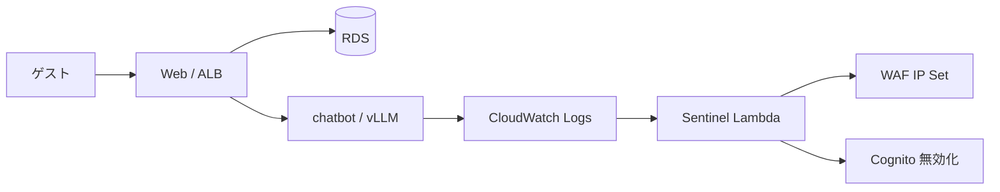
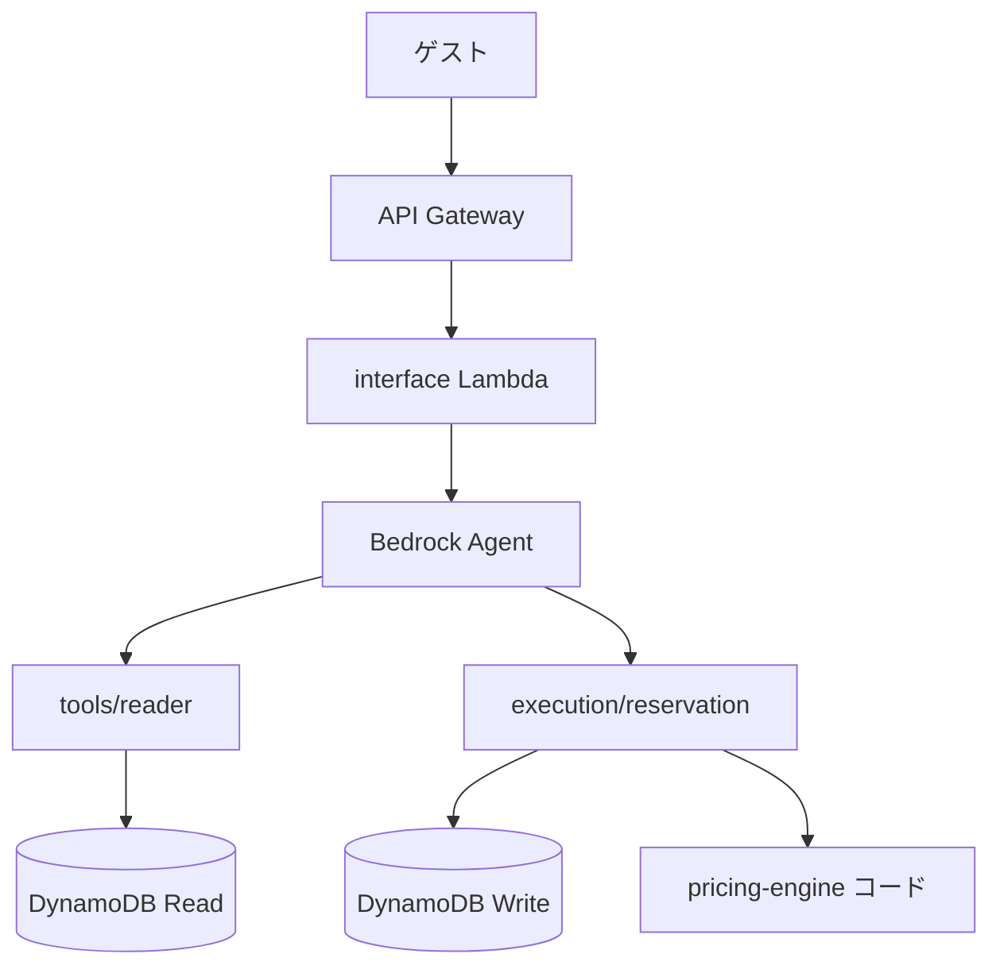
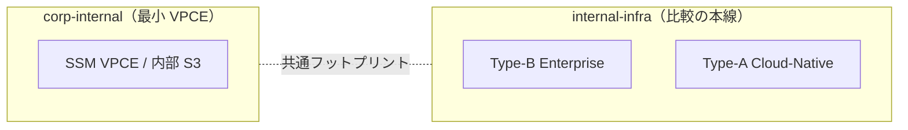

# アーキテクチャ図（Type-B vs Type-A）

## 外向け：Type-B（伝統 + Sentinel）

AI は **会話とログ監視の補助**。予約の正は RDS。防御は **ルールベース**。

## 外向け：Type-A（関所付きオーケストレーター）

- **interface:** 副作用なし（Agent 起動のみ）
- **execution:** スキーマ検証・冪等・料金計算（LLM 非使用）後に書き込み
- **Gray ゾーン:** Agent が「いつ execution を呼ぶか」は AI 側。将来は意図 JSON のみを Agent 出力に限定する改善余地あり（[`STRUCTURE.md`](../STRUCTURE.md)）

## 社内インフラ

**正:** 社内の拡張・比較は `internal-infra/terraform/`。`terraform/corp-internal` は Session Manager 向けなど **最小 1 スタック** 用。
