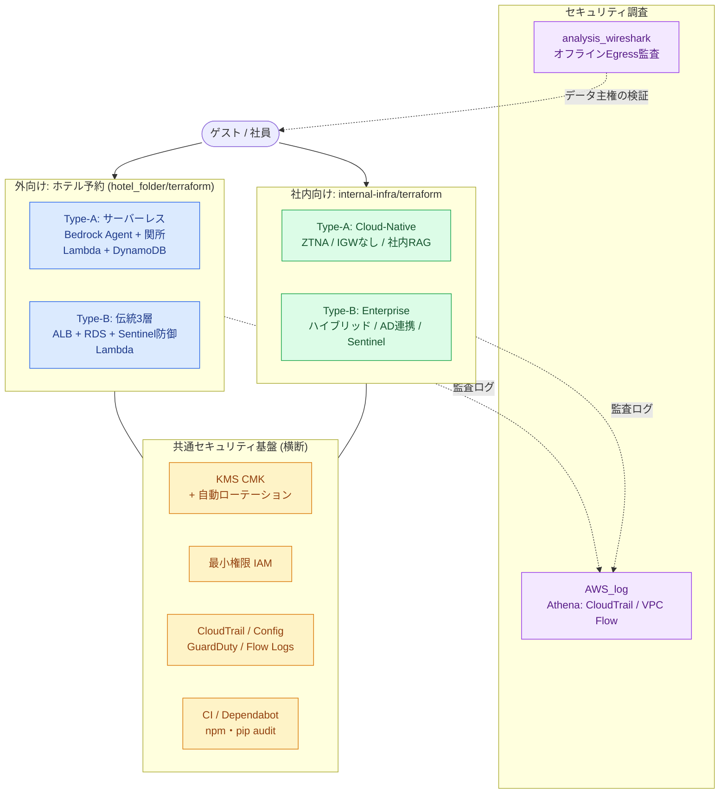
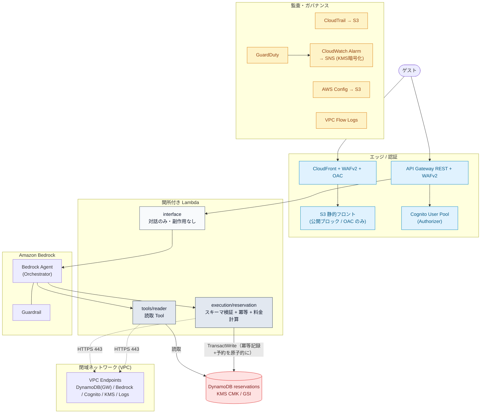
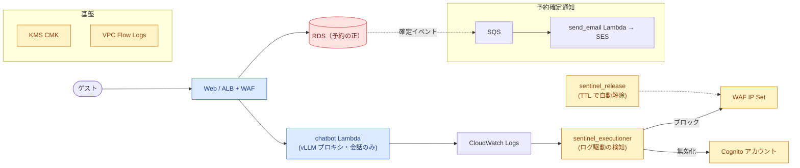
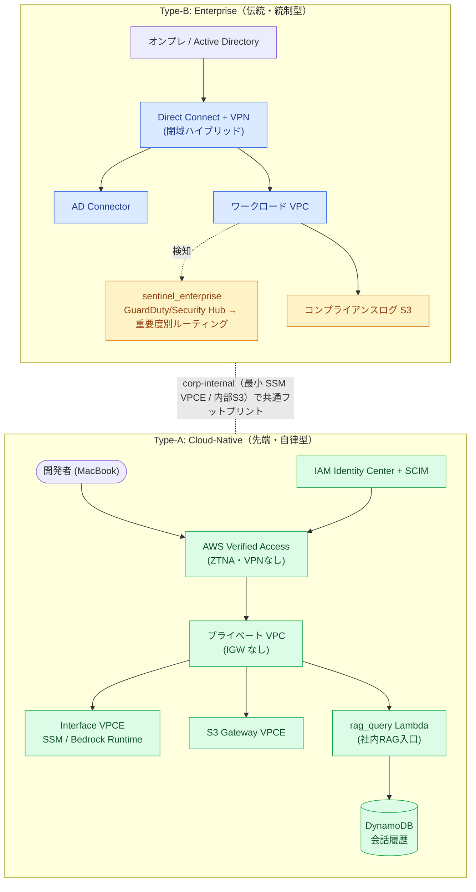

# アーキテクチャ図

> 面接・レビュー用の俯瞰図です。まず **0. 全体像（1枚）** を見れば、4 プロジェクトと共通セキュリティ基盤の関係が掴めます。各スタックの詳細は以降のセクションを参照してください。

---

## 0. 全体像（1 枚で俯瞰）

「外向け（ホテル予約）」「社内向け」「セキュリティ調査」の 3 領域を、**共通のセキュリティ基盤**の上に並べています。外向け・社内向けとも *同じ設計哲学*（顧客体験 / 企業文化を起点に Type-B＝伝統・統制型 と Type-A＝先端・自律型 を対比）で構成しています。

---

## 1. 外向け Type-A（サーバーレス + 関所付きオーケストレーター）★中核

完全サーバーレス。**White（対話）→ Gray（読取/検証）→ 実行（書込）** と責務を関所で分離し、書き込みに触れるのは `execution/reservation` だけ。エッジ〜認証〜AI〜データまで、各層にセキュリティ統制を敷いています。

- **interface:** Bedrock Agent を起動するだけ（副作用なし）。不正 JSON は 400 で弾く。
- **execution:** AJV でスキーマ検証 → 料金計算 → `TransactWriteCommand` で冪等記録と予約を**原子的に**書き込み（孤立レコードを防止）。LLM は使わない決定論的処理。
- **Gray ゾーンの既知課題:** Agent が「いつ execution を呼ぶか」は AI 判断。将来は Agent 出力を意図 JSON のみに限定する改善余地あり（[`STRUCTURE.md`](../STRUCTURE.md)）。

---

## 2. 外向け Type-B（伝統 3 層 + Sentinel 防御ループ）

ユーザーが触れるフロント / 基幹 DB は堅牢な 3 層を維持。**AI は会話とログ監視の裏方**で、防御は決定論的なルールベース（Sentinel）に寄せています。

- **多層防御:** WAF → ALB → アプリ → RDS。アプリ層の外向き通信は VPC 内に制限。
- **Sentinel:** ログ検知で WAF IP Set 追加 / Cognito 無効化。`sentinel_release` が TTL ベースで解除。
- **KMS / SNS:** CloudWatch アラームが KMS 暗号化 SNS へ発行できるよう、キーポリシーに `events` / `cloudwatch` 主体を許可（修正済み）。

---

## 3. 社内インフラ（Enterprise vs Cloud-Native）

外向けと同じ「Type-B＝統制 / Type-A＝自律」の哲学を社内に適用した比較検証。

| 比較項目 | Type-B（統制型） | Type-A（自律型） |
|----------|------------------|------------------|
| ネットワーク | 閉域ハイブリッド（DX + VPN） | VPN なし・Verified Access（ZTNA） |
| ID 管理 | AD Connector で既存 AD 連携 | IAM Identity Center + SCIM |
| 開発者体験 | 承認必須・厳格な変更管理 | セルフサービス・Guardrails 内で自由 |
| セキュリティ | 検知・対応型（重要度別ルーティング） | 予防・自動化型（侵入させない設計） |
| AI の役割 | 脅威の自律検知・エスカレーション | 社内 RAG / セルフサービス支援 |

> **実装状況:** Sentinel / RAG / Verified Access は *IaC の骨格 + 挙動スタブ*。外部連携（Slack/Jira/実 KB）は未ワイヤ。詳細は [`internal-infra/README.md`](../internal-infra/README.md) と [`TECHNICAL_OVERVIEW.md`](TECHNICAL_OVERVIEW.md)。

---

## 関連ドキュメント

- 技術全体像: [`TECHNICAL_OVERVIEW.md`](TECHNICAL_OVERVIEW.md)
- 関所モデルの詳細: [`../STRUCTURE.md`](../STRUCTURE.md)
- 設計の意思決定（Type-B vs A）: [`DESIGN_TYPE_B_VS_A.md`](DESIGN_TYPE_B_VS_A.md)
- スコープと境界: [`../../README.md`](../../README.md) / [`PORTFOLIO_STRATEGY.md`](PORTFOLIO_STRATEGY.md)
