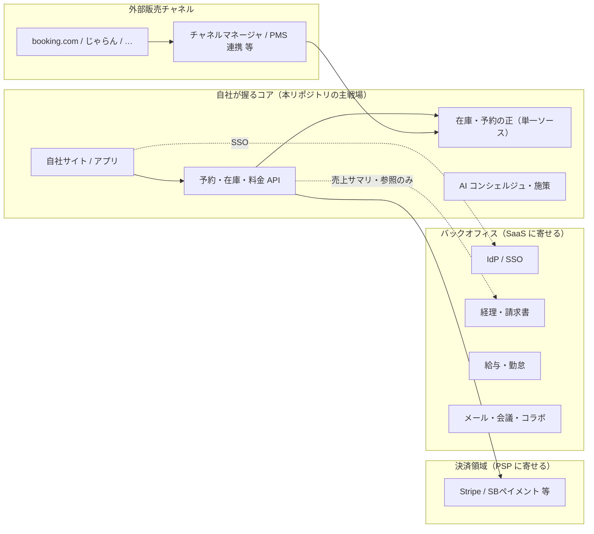

# 実ホテル運用で足りる境界線（決済・OTA・バックオフィス）

本稿は、ポートフォリオ上の **予約体験・インフラ（Type-B / Type-A）** と、**実際にホテル会社を稼働させる**ために追加で必要になる外部領域との **責務分界** を一文書にまとめたものです。実装手順ではなく、**何を自前に持ち、何をプロダクトに任せるか**の文案として使えます。

---

## 1. 狙い（1段落）

ゲスト向けの予約・AI コンシェルジュは **自社システム（AWS 上）の中核**とし、**カード決済の権威**・**OTA（外部販売チャネル）の多様性**・**会社運営のバックオフィス**は、それぞれ **PSP（決済代行）／チャネル・PMS エコシステム／SaaS** に分離する。これにより PCI の範囲を抑え、OTA の仕様変化にインフラ全体を引きずられず、開発リソースを **予約・在庫・ゲスト体験** に集中させる。

---

## 2. 全体像（責務の箱）

**読み取り:** 「お金を受け取る仕組み」の**カードデータと決済エンジン**は PSP。**OTA からの予約の取り込み**は、理想は **在庫の正に収束するパイプ**（自前アダプタか CM/PMS）。**経理・給与・メール**は AWS で再構築しない。

---

## 3. 決済（Stripe / SBペイメント等と PCI）

**自社の責務**

- 予約 ID と **支払い状態**（未払い／保留／確定／失効）の**業務ルール**を定義する。
- PSP が返す **決済 ID** と予約を**ひも付ける**。Webhook 受信は **冪等**（同じ結果が二度来ても壊れない）に実装する。
- ゲストから **カード番号を自社サーバに送らない**画面設計にする（**ホステッド決済ページ**やトークン化 UI で PSP 側に閉じる）。

**PSP の責務**

- カードデータの保管・決済ネットワークとの接続、**PCI DSS に適合した基盤**。

**PCI の考え方（文案レベル）**

- 目標は「当社はカード表面データを扱わない」**スコープ縮小**。**実運用の SAQ 区分・範囲評価は PSP の案内と、必要に応じて専門家レビュー**が前提。インフラコードだけでは完了しない。

---

## 4. 外部チャネル（booking.com・じゃらん等）

**自社の責務**

- **在庫・料金・予約の正**を一系統に保つ（ダブルブッキングを防ぐ**単一の集約**）。
- OTA 経由の予約を **同じ予約モデル**に正規化し、キャンセル・変更・No-show の**状態遷移**を運用で追えるようにする。
- 競合・遅延・同期失敗に対する **再試行・手動補正**の入口（運用・監視）。

**中間層（選定が分岐する部分）**

- **チャネルマネージャ／PMS 製品**を挟むか、**OTA ごとのアダプタ**を自前で持つか。前者はコストと一体運用、後者は柔軟だが保守負荷。**単館〜小規模チェーンでは CM/PMS 前提が現実的なことが多い**。

**本リポジトリの Type-B/A との関係**

- 自社サイト直販は **同一の在庫・料金サービス**を読む。**OTA は別入口だが、同じ「予約集約」に合流**させるのが境界のきれいな線引き。

---

## 5. 運用系 SaaS（経理・給与・勤怠・メール・会議）

**自社の責務**

- ホテル直営業・予約・顧客データの**主戦場**は自システム（または契約する PMS）。

**SaaS に任せる領域（文案）**

- 総務・人事・**給与・勤怠**、本格的な**会計・確定申告の土台**、**企業メール・カレンダー・ビデオ会議**は、各分野の SaaS の標準機能を利用する。**AWS 上に「会社全体の給与計算 Lambda」は置かない**のが現実解。

**連携の持ち方**

- 従業員・管理者の入口は **SSO（IdP 一本化）**で揃えると、離職・異動に強い。
- 売上・宿泊実績から経理へは **日次／月次の集計・エクスポート／会計ソフト連携**にとどめ、**仕様の深い結合は避ける**と差し替えが楽。

---

## 6. まとめ（使える一文）

> 本プロジェクトのアーキテクチャは、**ゲスト体験と予約・在庫の中核**にフォーカスする。決済は **PSP とホステッドフローでスコープを制御**し、OTA は **在庫の正へ収束する連携**に責務を閉じ、**会社のバックオフィスは SaaS と SSO で回す**。それでも不足するのは **ビジネス選定と運用設計**であり、Terraform の行数では埋まらない。

---

## 7. 関連ドキュメント

| ファイル | 用途 |
|----------|------|
| [`TECHNICAL_OVERVIEW.md`](TECHNICAL_OVERVIEW.md) | 本リポジトリ内の技術構成 |
| [`IMPLEMENTATION_GUIDE.md`](IMPLEMENTATION_GUIDE.md) | ビルド・Terraform 検証・デプロイの手順 |
