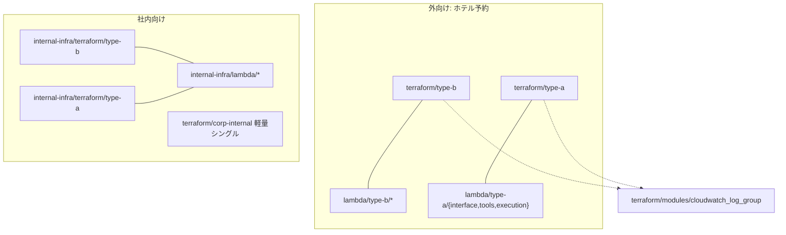

# 技術全体像（Technical Overview）

このドキュメントは、リポジトリを**主にエンジニア視点**で把握するためのものです。**操作手順**は [`IMPLEMENTATION_GUIDE.md`](IMPLEMENTATION_GUIDE.md)**、設計の意思決定（ホテル外向けの Type 分離）**は [`DESIGN_TYPE_B_VS_A.md`](DESIGN_TYPE_B_VS_A.md)** を参照してください。

---

## 1. スコープと前提

| 項目 | 内容 |
|------|------|
| IaC | Terraform（AWS Provider 5.x 系を主に使用） |
| 言語 | Lambda: **Node.js 20**（Type-B chatbot、Type-A interface / tools/reader / execution/reservation、社内 RAG スタブ）、**Python 3.11 想定**（Sentinel 系、社内 Sentinel スタブ） |
| State | スタックごとに **別 S3 キー** を推奨（例: `hotel-...`、`internal-infra/...`）。ローカル検証は `init -backend=false` |
| アプリ本体 | ポートフォリオ上、フロントや一部 Lambda は **インフラ検証用のスタブ**を含む（`PORTFOLIO_STRATEGY.md` 参照） |

---

## 2. リポジトリトポロジー

外向け（ホテル予約）と社内向け（Enterprise / Cloud-Native）を**同じリポジトリ**で並行させ、**Terraform ルートと state を分離**しています。

**読み方:**

- **外向け**の Type-B / Type-A は、それぞれ **独立した巨大 `main.tf` 相当**を持ち、VPC・認証・API・Lambda・監査系まで一連で記述している。
- **社内向け**の **本線**は `internal-infra/terraform/{type-b,type-a}`。`terraform/corp-internal` は **最小1本**の別ルートで、VPCE／内部 S3 など薄いスタック向け（[`readme.md` の「正」](../readme.md) に準拠）。

---

## 3. Terraform スタック一覧（技術的対応）

| パス | 役割（技術） | 備考 |
|------|----------------|------|
| `terraform/type-b` | **伝統型 3 層 + WAF/Cognito/RDS 系**、Sentinel（ログ駆動の防御 Lambda）、API Gateway v2 等 | 単一モジュールに近い大きい定義。SG / KMS / Flow log 等を包含 |
| `terraform/type-a` | **サーバーレス + Bedrock Agent**、DynamoDB、API Gateway REST、Cognito、VPC + **多数の VPC Endpoints**、CloudTrail / Config 等 | `null_resource` + `local-exec` で Agent 準備を呼ぶ箇所あり |
| `terraform/modules/cloudwatch_log_group` | CloudWatch Log Group の **共通化**（name / retention / KMS） | type-b / type-a から module 参照 |
| `terraform/corp-internal` | 社内向け **最小**（プライベート VPC、SSM 系 VPCE、内部 S3 等） | `internal-infra` と CIDR／名前空間の衝突に注意 |
| `internal-infra/terraform/type-b` | 社内 **Enterprise** 比較用：KMS、コンプライアンスログ用 S3、ワークロード用 VPC、Flow Logs 等 | 段階的に TGW / AD Connector 等へ拡張する前提の**たたき** |
| `internal-infra/terraform/type-a` | 社内 **Cloud-Native** 比較用：**IGW なし** VPC、SSM/Bedrock Runtime の Interface VPCE、S3 Gateway、DynamoDB（会話履歴）等 | Verified Access はアカウント前提のため未構成でも可 |

各 `terraform { backend "s3" { ... } }` の **bucket / key は環境ごとに差し替え**必須（プレースホルダ `YOUR-TERRAFORM-STATE-BUCKET`）。

---

## 4. Lambda とランタイム（外向け）

ビルドはルート `Makefile` の `make build` で **`lambda/*.zip`** に集約（Terraform の変数デフォルトと整合）。

| 名前（概念的） | コード場所 | ランタイム | 役割（技術） |
|----------------|------------|------------|----------------|
| chatbot（Type-B） | `lambda/type-b/chatbot` | Node 20 | vLLM 等へプロキシするチャット API スタブ、Vitest |
| sentinel_executioner | `lambda/type-b/sentinel_executioner` | Python | CloudWatch ログトリガ想定の防御ロジック、pytest |
| sentinel_release | `lambda/type-b/sentinel_release` | Python | TTL ベースのブロック解除等、pytest |
| interface（Type-A） | `lambda/type-a/interface` | Node 20 | API GW → Bedrock Agent（対話のみ）、Vitest |
| reader（Type-A） | `lambda/type-a/tools/reader` | Node 20 | Bedrock Agent 用の読み取り Tool、Vitest |
| reservation（Type-A） | `lambda/type-a/execution/reservation` | Node 20 | 予約の決定論的書き込み（実行層）、Vitest |

---

## 5. 社内向け Lambda（スタブ）

| ディレクトリ | ランタイム | 役割（設計上の位置づけ） |
|--------------|------------|---------------------------|
| `internal-infra/lambda/sentinel_enterprise` | Python | GuardDuty / Security Hub 系イベントの **重要度別ルーティング**（スタブ） |
| `internal-infra/lambda/sentinel_cloud_native` | Python | **予防・自動応答**イメージのルーティング（スタブ） |
| `internal-infra/lambda/rag_query` | Node 20 | 社内 RAG / KB への質問入口（スタブ）、Vitest |

テスト: `make -C internal-infra test` またはルート `make test`（`test-internal-infra` 経由）。

---

## 6. セキュリティ・ネットワーク（横断的な技術方針）

以下は **コードとして現れている方針**の要約です（スタックごとに未適用箇所あり）。

- **KMS:** CMK、ローテーション、一部キーポリシーに **`aws:SourceAccount`** 条件（クロスアカウント誤用の抑制）。
- **ログ:** CloudWatch のロググループを **モジュール化**し、保持日数・KMS を揃えやすくしている。
- **ネットワーク:** Type-B ではアプリ層の **外向きを VPC 内向きに制限**し、必要箇所は **SG ルール分離**で依存サイクルを回避。
- **IAM（Type-A の例）:** Lambda の CloudWatch 権限を **`/aws/lambda/${app_name}-reader|interface|reservation:*` 程度**まで絞る試み。
- **社内 Cloud-Native:** パブリック IGW なし、**PrivateLink 型 VPCE** と Gateway VPCE（S3）で閉域寄り。

---

## 7. 品質ゲート（CI / ローカル）

| コマンド | 内容 |
|----------|------|
| `make test` | 全外向け Lambda + **internal-infra** Lambda のテスト |
| `make terraform-fmt-check` | 全 Terraform ルート（type-b、type-a、corp-internal、internal-infra 両系統）の `fmt -check` |
| `make terraform-validate` | 同上の `init -backend=false` + `validate` |
| `make ci` | `test` + fmt + validate |
| Dependabot | `.github/dependabot.yml`（npm/pip/GitHub Actions） |
| `supply-chain-security.yml` | `npm audit` / `pip-audit`（定期・手動） |

---

## 8. データフロー（外向け Type-A 抜粋・概念）

ゲスト → **CloudFront / API Gateway** → **Cognito** → **`interface` Lambda** → **Bedrock Agent** → **`tools/reader` / `execution/reservation`**。書き込みは **reservation** のみが **DynamoDB** に触れる。詳細は [`STRUCTURE.md`](../STRUCTURE.md) と `terraform/type-a/main.tf`。

---

## 9. 設計上の境界（何が「完成」と言えるか）

| レイヤ | 状態の目安 |
|--------|------------|
| インフラ定義 | 広くカバー。本番は **変数・バックエンド・アカウント境界**の確定が必要 |
| Lambda | 多くが **テスト付きスタブ**。プロダクションではシークレット管理・観測性・レート制限を追加 |
| 社内 RAG / Sentinel Enterprise | **挙動のスタブと IaC の骨格**。外部システム（Slack、Jira、実 KD）との連携は未ワイヤ |

---

## 10. 関連ドキュメント

| ファイル | 用途 |
|----------|------|
| [`IMPLEMENTATION_GUIDE.md`](IMPLEMENTATION_GUIDE.md) | インストール・apply 順・トラブルシュート |
| [`DESIGN_TYPE_B_VS_A.md`](DESIGN_TYPE_B_VS_A.md) | 企業セグメント別の設計分離 |
| [`ARCHITECTURE.md`](ARCHITECTURE.md) | Type-B / Type-A / 社内の Mermaid 図 |
| [`EXECUTION_PLAN.md`](EXECUTION_PLAN.md) | ロードマップ・チケット粒度 |
| [`REAL_WORLD_HOTEL_INTEGRATIONS.md`](REAL_WORLD_HOTEL_INTEGRATIONS.md) | 実ホテル運用（決済・OTA・SaaS）の責務分界 |
| [`internal-infra/README.md`](../internal-infra/README.md) | 社内インフラの物語と比較表 |
| [`PORTFOLIO_STRATEGY.md`](../PORTFOLIO_STRATEGY.md) | ポートフォリオのスコープと境界 |

---

## 11. 改訂

設計変更やスタック追加時は、**本ファイル**と **`readme.md` の Repository Structure** をセットで更新すると、全体説明との齟齬を防げます。
